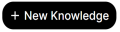

import { Steps, Aside } from '@astrojs/starlight/components';

The Models tab allows you to create your own custom models by setting system prompts, attaching knowledge bases by default (no more need to click on the + button when prompting), or adjusting the advanced parameters. By attaching a knowledge base, you are creating a RAG system. See [here](https://docs.openwebui.com/features/ai-knowledge/models) for the official documentation.

### Creating Models
<Steps>
1. Navigate to **Workspace**, then click on **Models**. You should see all the models created by other users that are public on Nebula.

2. Click on the **+ New Model** button on the top right of the screen.

3. Follow the instructions on the screen for creating the Model.

     a. We recommend setting a System Prompt. Example: “You are a helpful assistant.”

    b. Please have a look at the [Advanced Parameters](/welcome/advancedParams), and [Modifying Advanced Parameters](/welcome/modifyingAdvancedParams) sections if you want to edit the advanced parameters section

4. Click on **Save & Create**.
</Steps>

### Editing Models
<Steps>
1. Navigate to **Workspace -> Models**.
2. On the model you want to edit, click on the **three horizontal dots** button, then **Edit**. Note: You can only edit models that do not have the **READ ONLY** tag.
3. Edit your model.
4. Click on **Save & Update**.
</Steps>

### Deleting Models
<Steps>
1. Navigate to **Workspace -> Models**.
2. Click on the three horizontal dots next to your model. Note: You can only delete models that do not have the **READ ONLY** tag.
3. Click on **Delete**.
</Steps>
